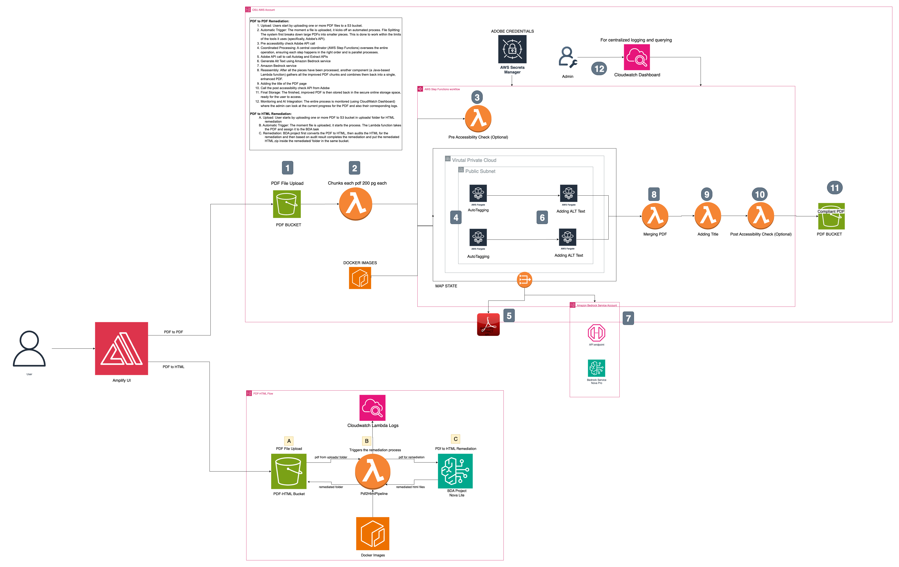

# PDF Accessibility Solutions

This repository provides two complementary solutions for PDF accessibility:

1. **PDF-to-PDF Remediation**: Processes PDFs and maintains the PDF format while improving accessibility.
2. **PDF-to-HTML Remediation**: Converts PDFs to accessible HTML format.

Both solutions leverage AWS services and generative AI to improve content accessibility according to WCAG 2.1 Level AA standards.

## Table of Contents

| Index                                                                               | Description                                             |
| ----------------------------------------------------------------------------------- | ------------------------------------------------------- |
| [Architecture Overview](#architecture-overview)                                     | High level overview illustrating component interactions |
| [Automated One Click Deployment](#automated-one-click-deployment)                   | How to deploy the project                               |
| [Testing Your PDF Accessibility Solution](#testing-your-pdf-accessibility-solution) | User guide for the working solution                     |
| [PDF-to-PDF Remediation Solution](#pdf-to-pdf-remediation-solution)                 | PDF format preservation solution details                |
| [PDF-to-HTML Remediation Solution](#pdf-to-html-remediation-solution)               | HTML conversion solution details                        |
| [Monitoring](#monitoring)                                                           | System monitoring and observability                     |
| [Troubleshooting](#troubleshooting)                                                 | Common issues and solutions                             |
| [Contributing](#contributing)                                                       | How to contribute to the project                        |

## Architecture Overview

The following architecture diagram illustrates the various AWS components utilized to deliver the solution.



## Automated One Click Deployment

We provide a **unified deployment script** that allows you to deploy either or both the solutions with a single command. Choose your preferred solution during deployment:

### Prerequisites

**Common Requirements:**

1. **AWS Account** with appropriate permissions to create and manage AWS resources
   - See [IAM Permissions Guide](docs/IAM_PERMISSIONS.md) for detailed permission requirements
2. **AWS CloudShell access** (AWS CLI is pre-installed and configured automatically)
   - Sign in to the AWS Management Console
   - In the top navigation bar, click the CloudShell icon (terminal symbol) next to the search bar
   - Wait for CloudShell to initialize (this may take a few moments on first use)

**Solution-Specific Requirements:**

- **PDF-to-PDF**:
  - **Adobe API Access** - An enterprise-level contract or a trial account (For Testing) for Adobe's API is required.
    - [Adobe PDF Services API](https://acrobatservices.adobe.com/dc-integration-creation-app-cdn/main.html) to obtain API credentials.
- **PDF-to-HTML**: AWS Bedrock Data Automation service access
  - Ensure you have access to create a Bedrock Data Automation project - usually present by default

### One-Click Deployment

**Step 1: Open AWS CloudShell and Clone the Repository**

```bash
git clone https://github.com/ASUCICREPO/PDF_Accessibility.git
cd PDF_Accessibility
```

**Step 2: Run the Unified Deployment Script**

```bash
chmod +x deploy.sh
./deploy.sh
```

**Step 3: Follow the Interactive Prompts**

The script will guide you through:

1. **Solution Selection**: Choose between PDF-to-PDF or PDF-to-HTML remediation
2. **Solution-Specific Setup**:
   - **PDF-to-PDF**: Enter Adobe API credentials (stored securely in AWS Secrets Manager)
   - **PDF-to-HTML**: Automatic creation of Bedrock Data Automation project
3. **Automated Deployment**: Real-time monitoring of the deployment progress
4. **Optional UI Deployment**: After successful deployment of your chosen solution(s), you'll have the option to deploy a user interface as well

**Step 4: Test Your Deployment**

After successful deployment, the script provides specific testing instructions for your chosen solution.

### Testing Your PDF Accessibility Solution

#### PDF-to-PDF Solution Testing

1. **Navigate to Your S3 Bucket**

   - In the AWS S3 Console, find the bucket starting with `pdfaccessibility-`
   - This bucket was automatically created during deployment

2. **Create the Input Folder**

   - Create a folder named `pdf/` in the root of the bucket
   - This is where you'll upload PDFs for processing

3. **Upload Your PDF Files**

   - Upload any PDF file(s) to the `pdf/` folder
   - **Bulk Processing**: You can upload multiple PDFs in the bucket for batch remediation
   - The process automatically triggers when files are uploaded

4. **Monitor Processing**

   - **Temporary Files**: A `temp/` folder will be created containing intermediate processing files
   - **Final Results**: A `result/` folder will be created with your accessibility-compliant PDF files
   - Use the CloudWatch dashboard to monitor processing progress

5. **Download Results**
   - Navigate to the `result/` folder to access your remediated PDFs
   - Files maintain their original names with "COMPLIANT" prefix after accessibility improvements applied

#### PDF-to-HTML Solution Testing

1. **Navigate to Your S3 Bucket**

   - In the AWS S3 Console, find the bucket starting with `pdf2html-bucket-`
   - This bucket was automatically created during deployment

2. **Upload Your PDF Files**

   - Navigate to the `uploads/` folder (created automatically during deployment)
   - **Bulk Processing**: You can upload multiple PDFs in the bucket for batch remediation
   - The process automatically triggers when files are uploaded

3. **Monitor Processing**

   - Two folders will be created automatically:
     - **`output/`**: Contains temporary processing data and intermediate files
     - **`remediated/`**: Contains the final remediated results

4. **Access Your Results**

   - Navigate to the `remediated/` folder
   - Download the zip file named `final_{your-filename}.zip`

5. **Explore the Remediated Content**
   The downloaded zip file contains:
   - **`remediated.html`**: Final accessibility-compliant HTML version
   - **`result.html`**: Original HTML conversion (before remediation)
   - **`images/` folder**: Extracted images with generated alt text
   - **`remediation_report.html`**: Detailed report of accessibility improvements made
   - **`usage_data.json`**: Processing metrics and usage statistics

### Advanced Usage

**Redeployment**
After initial deployment, you can redeploy using the created CodeBuild project:

```bash
aws codebuild start-build --project-name YOUR-PROJECT-NAME --source-version main
```

Or simply re-run the deployment script and choose the solution your want redeploy.

## PDF-to-PDF Remediation Solution

### Overview

This solution processes PDFs while maintaining the original PDF format. It uses AWS CDK to build infrastructure that splits PDFs into chunks, processes them via AWS Step Functions, and merges the results using ECS tasks.

### Architecture

- **S3 Bucket**: Stores input and processed PDFs
- **Lambda Functions**: PDF splitting, merging, and accessibility checking
- **Step Functions**: Orchestrates the processing workflow
- **ECS Fargate**: Runs containerized processing tasks
- **CloudWatch Dashboard**: Monitors progress and performance

### Manual Deployment

For detailed manual deployment instructions, see our [Manual Deployment Guide](docs/MANUAL_DEPLOYMENT.md).

## PDF-to-HTML Remediation Solution

### Overview

This solution converts PDF documents to accessible HTML format while preserving layout and visual appearance. It leverages AWS Bedrock Data Automation for PDF parsing and uses a serverless Lambda architecture.

### Architecture

- **S3 Bucket**: Stores input PDFs and remediated HTML files
- **Lambda Function**: Processes PDFs using containerized accessibility utility
- **ECR Repository**: Hosts the Docker image for Lambda
- **Bedrock Data Automation**: Provides PDF parsing and extraction capabilities

## Monitoring

### PDF-to-PDF Solution

- **CloudWatch Dashboard**: Automatically created during deployment
- **Step Functions Console**: Monitor workflow executions
- **ECS Console**: Track container task status

### PDF-to-HTML Solution

- **Lambda Logs**: `/aws/lambda/Pdf2HtmlPipeline`
- **S3 Events**: Monitor file processing status
- **CloudWatch Metrics**: Track function performance

## Troubleshooting

### Common Issues

**AWS Credentials**

- Ensure AWS CLI is configured with appropriate permissions
- Verify access to required AWS services (S3, Lambda, ECS, Bedrock)

**Service Limits**

- Check AWS service quotas if deployment fails
- Request additional Elastic IPs if needed: [EC2 Service Quotas](https://us-east-1.console.aws.amazon.com/servicequotas/home/services/ec2/quotas)

**Build Failures**

- Check CodeBuild console for detailed error messages
- Verify all prerequisites are met
- Ensure Docker is available for PDF-to-HTML deployments

### Solution-Specific Troubleshooting

**PDF-to-PDF Issues**

- Verify Adobe API credentials are correct and active
- Check CloudWatch logs for Lambda functions and ECS tasks
- Ensure NOVA_PRO Bedrock model access is granted

**PDF-to-HTML Issues**

- Verify Bedrock Data Automation permissions
- Check Lambda function logs in CloudWatch
- Ensure Docker image was pushed to ECR successfully

### Getting Help

- Check build logs in CodeBuild console
- Review CloudWatch logs for runtime issues
- Verify all prerequisites are met
- For deployment issues, refer to: [CDK GitHub Issue](https://github.com/aws/aws-cdk/issues/30258)
- For additional troubleshooting: [Troubleshooting Guide](docs/TROUBLESHOOTING_CDK_DEPLOY.md)
- Contact support: **ai-cic@amazon.com**

## Contributing

Contributions to this project are welcome. Please fork the repository and submit a pull request with your changes.

## Acknowledgments

The PDF-to-HTML remediation functionality in this project is adapted from AWS Labs' [Content Accessibility Utility on AWS](https://github.com/awslabs/content-accessibility-utility-on-aws). This version includes updates and enhancements tailored for integration within the PDF Accessibility backend.

---

## Support

For questions, issues, or support:

- **Email**: ai-cic@amazon.com
- **Issues**: [GitHub Issues](https://github.com/ASUCICREPO/PDF_Accessibility/issues)

---

**Built by Arizona State University's AI Cloud Innovation Center (AI CIC)**  
**Powered by AWS**
