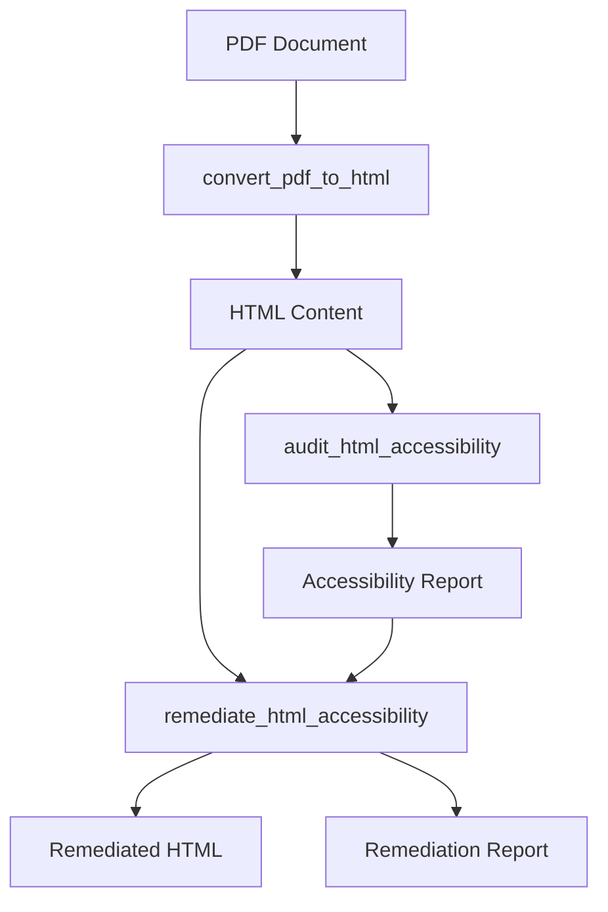

<!--
 Copyright 2025 Amazon.com, Inc. or its affiliates.
 SPDX-License-Identifier: Apache-2.0
-->

# Document Accessibility API Integration Guide

This guide provides detailed instructions for integrating the Document Accessibility library into your Python applications.

## Table of Contents
- [Overview](#overview)
- [Installation](#installation)
- [Core Concepts](#core-concepts)
- [Basic Usage](#basic-usage)
- [Advanced Integration](#advanced-integration)
- [Error Handling](#error-handling)
- [Configuration Management](#configuration-management)
- [AWS Integration](#aws-integration)
- [Performance Optimization](#performance-optimization)
- [Common Integration Patterns](#common-integration-patterns)
- [API Reference](#api-reference)

## Overview

The Document Accessibility library provides a programmatic API for:

1. Converting PDF documents to accessible HTML
2. Auditing HTML content for WCAG 2.1 compliance
3. Remediating accessibility issues automatically
4. Processing documents in batch mode
5. Generating comprehensive accessibility reports

This guide focuses on integrating these capabilities into your own applications.

## Installation

### Basic Installation

```bash
pip install document-accessibility
```

### Development Installation

```bash
git clone https://github.com/yourusername/document-accessibility.git
cd document-accessibility
pip install -e . --use-pep517
```

### Dependencies

The library requires:
- Python 3.11+
- AWS credentials (for PDF conversion and certain remediation features)
- Internet connectivity (for model-based remediation)

## Core Concepts

### Processing Pipeline

The library follows a three-step pipeline architecture:

1. **Conversion**: PDF → HTML
2. **Audit**: HTML → Accessibility Report
3. **Remediation**: HTML + Report → Accessible HTML

Each step can be used independently or as part of the complete pipeline.

### Data Flow



### Key Components

- **PDF2HTML**: Handles PDF parsing and conversion
- **Audit**: Identifies accessibility issues
- **Remediation**: Fixes identified issues
- **Batch**: Processes multiple documents at scale

## Basic Usage

### Full Processing Pipeline

```python
from document_accessibility.api import process_pdf_accessibility

# Process a PDF through the full pipeline
result = process_pdf_accessibility(
    pdf_path="document.pdf",
    output_dir="output/",
    conversion_options={
        "single_file": True,
        "image_format": "png"
    },
    audit_options={
        "severity_threshold": "minor",
        "detailed": True
    },
    remediation_options={
        "model_id": "amazon.nova-lite-v1:0",
        "auto_fix": True
    },
    perform_audit=True,
    perform_remediation=True
)

# Access results
html_path = result["conversion_result"]["html_path"]
audit_issues = result["audit_result"]["issues"]
fixed_issues = result["remediation_result"]["fixed_issues"]
```

### Step-by-Step Processing

```python
from document_accessibility.api import (
    convert_pdf_to_html,
    audit_html_accessibility,
    remediate_html_accessibility
)

# Step 1: Convert PDF to HTML
conversion_result = convert_pdf_to_html(
    pdf_path="document.pdf",
    output_dir="output/",
    options={
        "single_file": True,
        "image_format": "png"
    }
)
html_path = conversion_result["html_path"]

# Step 2: Audit HTML for accessibility issues
audit_result = audit_html_accessibility(
    html_path=html_path,
    options={
        "severity_threshold": "minor",
        "detailed": True
    }
)

# Step 3: Remediate accessibility issues
remediation_result = remediate_html_accessibility(
    html_path=html_path,
    audit_report=audit_result,
    options={
        "model_id": "amazon.nova-lite-v1:0",
        "auto_fix": True
    }
)

# Generate remediation report
from document_accessibility.api import generate_remediation_report
report_path = generate_remediation_report(
    remediation_data=remediation_result,
    output_path="output/remediation_report.html",
    report_format="html"
)
```

## Advanced Integration

### Custom Processing Logic

You can access lower-level components for more fine-grained control:

```python
from document_accessibility.pdf2html.api import PDFtoHTMLConverter
from document_accessibility.audit.auditor import AccessibilityAuditor
from document_accessibility.remediate.remediator import AccessibilityRemediator

# Create a custom PDF converter
converter = PDFtoHTMLConverter(
    s3_bucket="my-bucket",
    bda_project_arn="arn:aws:bedrock:us-west-2:123456789012:project/my-project"
)

# Convert a specific PDF
html_content = converter.convert_pdf(
    pdf_path="document.pdf",
    single_file=True,
    extract_images=True
)

# Create an auditor with custom settings
auditor = AccessibilityAuditor(
    issue_types=["missing-alt-text", "heading-structure", "color-contrast"],
    severity_threshold="major"
)

# Run the audit
audit_results = auditor.audit_html(html_content)

# Create a remediator
remediator = AccessibilityRemediator(
    model_id="amazon.nova-lite-v1:0"
)

# Remediate specific issues
remediated_html = remediator.remediate(
    html_content=html_content,
    issues=audit_results.issues,
    max_issues=10
)
```

### Event Callbacks

You can register callbacks for progress monitoring:

```python
from document_accessibility.api import process_pdf_accessibility

def progress_callback(event_type, data):
    if event_type == "conversion_progress":
        print(f"Conversion: {data['progress']}% complete")
    elif event_type == "audit_progress":
        print(f"Audit: {data['issues_found']} issues found so far")
    elif event_type == "remediation_progress":
        print(f"Remediation: Fixed {data['issues_fixed']} of {data['total_issues']} issues")

# Process with progress tracking
result = process_pdf_accessibility(
    pdf_path="document.pdf",
    output_dir="output/",
    callbacks={
        "progress": progress_callback
    }
)
```

### Batch Processing

Process multiple documents efficiently:

```python
from document_accessibility.batch import submit_batch_job, check_job_status, get_job_results
import time

# Start batch job
job_id = submit_batch_job(
    input_files=["doc1.pdf", "doc2.pdf", "doc3.pdf"],
    output_bucket="my-bucket",
    output_prefix="processed/",
    process_options={
        "perform_audit": True,
        "perform_remediation": True,
        "severity": "major"
    }
)

# Monitor progress
while True:
    status = check_job_status(job_id)
    print(f"Progress: {status['files_processed']} of {status['total_files']}")
    
    if status["status"] in ["COMPLETED", "FAILED"]:
        break
        
    time.sleep(5)

# Get results
if status["status"] == "COMPLETED":
    results = get_job_results(job_id)
    print(f"Successful: {results['successful_count']}")
    print(f"Failed: {results['failed_count']}")
```

## Error Handling

### Best Practices

1. **Use try/except blocks**: Catch specific exceptions
2. **Check result status**: Verify success before proceeding
3. **Implement retries**: For transient failures
4. **Log errors**: Capture details for debugging

### Example with Error Handling

```python
from document_accessibility.api import convert_pdf_to_html
from document_accessibility.utils.error_handling import (
    ConversionError, 
    AWSConfigurationError,
    BDAProcessingError
)
import logging
import time

# Set up logging
logging.basicConfig(level=logging.INFO)
logger = logging.getLogger(__name__)

def convert_with_retry(pdf_path, output_dir, max_retries=3):
    retries = 0
    while retries < max_retries:
        try:
            result = convert_pdf_to_html(
                pdf_path=pdf_path,
                output_dir=output_dir
            )
            return result
        except AWSConfigurationError as e:
            # Configuration errors won't be resolved with retries
            logger.error(f"AWS configuration error: {str(e)}")
            raise
        except BDAProcessingError as e:
            # BDA processing errors might be transient
            retries += 1
            wait_time = 2 ** retries  # Exponential backoff
            logger.warning(f"BDA processing error (attempt {retries}/{max_retries}): {str(e)}")
            logger.info(f"Retrying in {wait_time} seconds...")
            time.sleep(wait_time)
        except ConversionError as e:
            # General conversion errors
            logger.error(f"Conversion failed: {str(e)}")
            raise
        except Exception as e:
            # Unexpected errors
            logger.error(f"Unexpected error: {str(e)}")
            raise
    
    # If we've exhausted retries
    raise ConversionError(f"Failed to convert PDF after {max_retries} attempts")
```

## Configuration Management

### Environment Variables

The library respects these environment variables:

```python
import os

# AWS configuration
os.environ["BDA_S3_BUCKET"] = "my-accessibility-bucket"
os.environ["BDA_PROJECT_ARN"] = "arn:aws:bedrock:us-west-2:123456789012:project/my-project"
os.environ["AWS_PROFILE"] = "accessibility"

# Working directory for the Streamlit app
os.environ["DOCUMENT_ACCESSIBILITY_WORK_DIR"] = "/tmp/accessibility-work"
```

### Configuration File

You can also use a configuration file:

```python
from document_accessibility.utils.config import load_config, save_config

# Load configuration
config = load_config("accessibility_config.yaml")

# Update configuration
config["aws"]["s3_bucket"] = "new-bucket-name"
config["remediation"]["model_id"] = "amazon.nova-lite-v1:0"

# Save configuration
save_config(config, "accessibility_config.yaml")

# Use in processing
from document_accessibility.api import process_pdf_accessibility

result = process_pdf_accessibility(
    pdf_path="document.pdf",
    output_dir="output/",
    config=config
)
```

## AWS Integration

### Credentials Management

```python
# Method 1: Use a specific profile
from document_accessibility.api import convert_pdf_to_html

result = convert_pdf_to_html(
    pdf_path="document.pdf",
    output_dir="output/",
    profile="accessibility"
)

# Method 2: Use session credentials
import boto3
from document_accessibility.pdf2html.api import PDFtoHTMLConverter

session = boto3.Session(
    aws_access_key_id="YOUR_ACCESS_KEY",
    aws_secret_access_key="YOUR_SECRET_KEY",
    region_name="us-west-2"
)

converter = PDFtoHTMLConverter.from_session(
    session=session,
    s3_bucket="my-bucket"
)

result = converter.convert_pdf("document.pdf", output_dir="output/")
```

### S3 Integration

```python
# Upload a document to S3 first
import boto3

s3_client = boto3.client('s3')
s3_client.upload_file("document.pdf", "my-bucket", "documents/document.pdf")

# Process from S3
from document_accessibility.batch import submit_s3_job

job_id = submit_s3_job(
    input_bucket="my-bucket",
    input_key="documents/document.pdf",
    output_bucket="my-bucket",
    output_prefix="processed/"
)
```

## Performance Optimization

### Memory Management

```python
# For large documents, process page by page
from document_accessibility.api import convert_pdf_to_html

# Use multi-page output for large documents
result = convert_pdf_to_html(
    pdf_path="large_document.pdf",
    output_dir="output/",
    options={
        "multi_page": True,  # Split into multiple files
        "cleanup_temp": True  # Remove temporary files
    }
)

# Process each page separately
from document_accessibility.api import audit_html_accessibility

for html_file in result["html_files"]:
    audit_result = audit_html_accessibility(
        html_path=html_file,
        options={"detailed": False}  # Reduce memory usage
    )
```

### Parallel Processing

```python
from concurrent.futures import ThreadPoolExecutor
from document_accessibility.api import convert_pdf_to_html

def process_document(pdf_path):
    output_dir = f"output/{os.path.basename(pdf_path).split('.')[0]}"
    return convert_pdf_to_html(pdf_path, output_dir=output_dir)

# Process multiple documents in parallel
pdf_files = ["doc1.pdf", "doc2.pdf", "doc3.pdf", "doc4.pdf"]

with ThreadPoolExecutor(max_workers=4) as executor:
    results = list(executor.map(process_document, pdf_files))
```

## Common Integration Patterns

### Web Application Integration

```python
from flask import Flask, request, jsonify
from document_accessibility.api import process_pdf_accessibility
import tempfile
import os

app = Flask(__name__)

@app.route('/process', methods=['POST'])
def process_document():
    # Check if the post request has the file part
    if 'file' not in request.files:
        return jsonify({"error": "No file part"}), 400
    
    file = request.files['file']
    if file.filename == '':
        return jsonify({"error": "No selected file"}), 400
    
    # Save the file temporarily
    temp_dir = tempfile.mkdtemp()
    pdf_path = os.path.join(temp_dir, file.filename)
    file.save(pdf_path)
    
    try:
        # Process the PDF
        result = process_pdf_accessibility(
            pdf_path=pdf_path,
            output_dir=temp_dir,
            perform_audit=True,
            perform_remediation=True
        )
        
        # Prepare response
        response = {
            "html_path": result["conversion_result"]["html_path"],
            "issues_found": len(result["audit_result"]["issues"]),
            "issues_fixed": len(result["remediation_result"]["fixed_issues"]),
            "remaining_issues": len(result["remediation_result"]["remaining_issues"])
        }
        
        return jsonify(response)
    
    except Exception as e:
        return jsonify({"error": str(e)}), 500
    
    finally:
        # Clean up temporary files
        import shutil
        shutil.rmtree(temp_dir)

if __name__ == '__main__':
    app.run(debug=True)
```

### Content Management System Integration

```python
from document_accessibility.api import convert_pdf_to_html, audit_html_accessibility
import os

class AccessibilityProcessor:
    def __init__(self, upload_dir, output_dir):
        self.upload_dir = upload_dir
        self.output_dir = output_dir
    
    def process_uploads(self):
        """Process all PDFs in the upload directory"""
        results = {}
        
        for filename in os.listdir(self.upload_dir):
            if filename.lower().endswith('.pdf'):
                pdf_path = os.path.join(self.upload_dir, filename)
                base_name = os.path.splitext(filename)[0]
                doc_output_dir = os.path.join(self.output_dir, base_name)
                
                try:
                    # Convert to HTML
                    conversion_result = convert_pdf_to_html(
                        pdf_path=pdf_path,
                        output_dir=doc_output_dir
                    )
                    
                    # Audit for accessibility
                    audit_result = audit_html_accessibility(
                        html_path=conversion_result["html_path"]
                    )
                    
                    # Store results
                    results[filename] = {
                        "html_path": conversion_result["html_path"],
                        "image_count": len(conversion_result.get("image_files", [])),
                        "issues_count": len(audit_result["issues"]),
                        "compliance_score": self._calculate_score(audit_result)
                    }
                    
                except Exception as e:
                    results[filename] = {"error": str(e)}
        
        return results
    
    def _calculate_score(self, audit_result):
        """Calculate a simple compliance score"""
        issues = audit_result.get("issues", [])
        if not issues:
            return 100  # Perfect score
        
        # Count by severity
        critical = sum(1 for i in issues if i.get("severity") == "critical")
        major = sum(1 for i in issues if i.get("severity") == "major")
        minor = sum(1 for i in issues if i.get("severity") == "minor")
        
        # Calculate weighted score (lower is better)
        weighted_sum = critical * 5 + major * 3 + minor * 1
        
        # Convert to 0-100 scale (higher is better)
        max_deduction = 100
        score = max(0, 100 - min(weighted_sum, max_deduction))
        
        return score
```

### Automated Document Processing Pipeline

```python
import os
import time
import logging
from watchdog.observers import Observer
from watchdog.events import FileSystemEventHandler
from document_accessibility.api import process_pdf_accessibility

class PDFHandler(FileSystemEventHandler):
    def __init__(self, input_dir, output_dir):
        self.input_dir = input_dir
        self.output_dir = output_dir
        self.logger = logging.getLogger("PDFHandler")
    
    def on_created(self, event):
        if event.is_directory:
            return
        
        if event.src_path.lower().endswith('.pdf'):
            self.logger.info(f"New PDF detected: {event.src_path}")
            self.process_pdf(event.src_path)
    
    def process_pdf(self, pdf_path):
        try:
            filename = os.path.basename(pdf_path)
            base_name = os.path.splitext(filename)[0]
            doc_output_dir = os.path.join(self.output_dir, base_name)
            
            self.logger.info(f"Processing {filename} to {doc_output_dir}")
            
            # Process the PDF
            result = process_pdf_accessibility(
                pdf_path=pdf_path,
                output_dir=doc_output_dir,
                conversion_options={"single_file": True},
                perform_audit=True,
                perform_remediation=True
            )
            
            self.logger.info(f"Processed {filename} successfully")
            self.logger.info(f"HTML output: {result['conversion_result']['html_path']}")
            self.logger.info(f"Issues found: {len(result['audit_result']['issues'])}")
            self.logger.info(f"Issues fixed: {len(result['remediation_result']['fixed_issues'])}")
            
        except Exception as e:
            self.logger.error(f"Error processing {pdf_path}: {str(e)}")

def start_watcher(input_dir, output_dir):
    event_handler = PDFHandler(input_dir, output_dir)
    observer = Observer()
    observer.schedule(event_handler, input_dir, recursive=False)
    observer.start()
    
    try:
        while True:
            time.sleep(1)
    except KeyboardInterrupt:
        observer.stop()
    
    observer.join()

if __name__ == "__main__":
    logging.basicConfig(level=logging.INFO)
    start_watcher("input_documents", "processed_documents")
```

## API Reference

### Main API Functions

| Function | Description | Return Value |
|----------|-------------|--------------|
| `process_pdf_accessibility()` | Full pipeline (convert, audit, remediate) | Dictionary with results from each stage |
| `convert_pdf_to_html()` | Convert PDF to accessible HTML | Dictionary with html_path and other details |
| `audit_html_accessibility()` | Check HTML for accessibility issues | Dictionary with issues list and summary |
| `remediate_html_accessibility()` | Fix accessibility issues in HTML | Dictionary with fixed_issues, remaining_issues |
| `generate_remediation_report()` | Create report of remediation results | Path to the generated report |

### PDF2HTML Module

| Class/Function | Description |
|----------------|-------------|
| `PDFtoHTMLConverter` | Main converter class with methods for PDF analysis and conversion |
| `extract_pdf_images()` | Extract images from a PDF file |
| `analyze_pdf_structure()` | Analyze PDF structure without conversion |

### Audit Module

| Class/Function | Description |
|----------------|-------------|
| `AccessibilityAuditor` | Main auditor class with methods for WCAG checks |
| `ContextCollector` | Gathers context about HTML elements |
| `get_wcag_criteria()` | Get details about specific WCAG criteria |

### Remediation Module

| Class/Function | Description |
|----------------|-------------|
| `AccessibilityRemediator` | Main remediator class for fixing issues |
| `generate_alt_text()` | Generate alt text for images |
| `fix_table_structure()` | Improve accessibility of HTML tables |
| `apply_heading_structure()` | Fix heading hierarchy issues |

### Batch Module

| Class/Function | Description |
|----------------|-------------|
| `submit_batch_job()` | Start a batch processing job |
| `check_job_status()` | Check status of a batch job |
| `get_job_results()` | Get results of a completed batch job |
| `BatchPDFConverter` | Process multiple PDFs in batch |
| `BatchAuditor` | Audit multiple HTML documents |
| `BatchRemediator` | Remediate multiple HTML documents |
