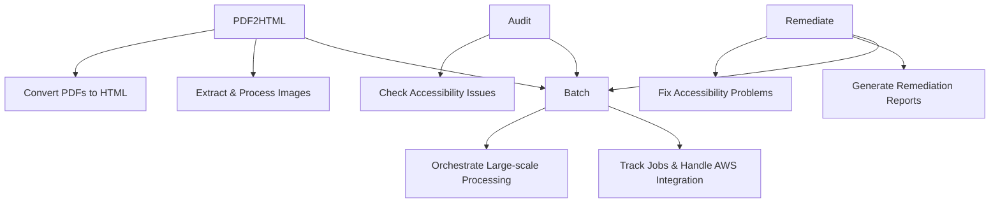
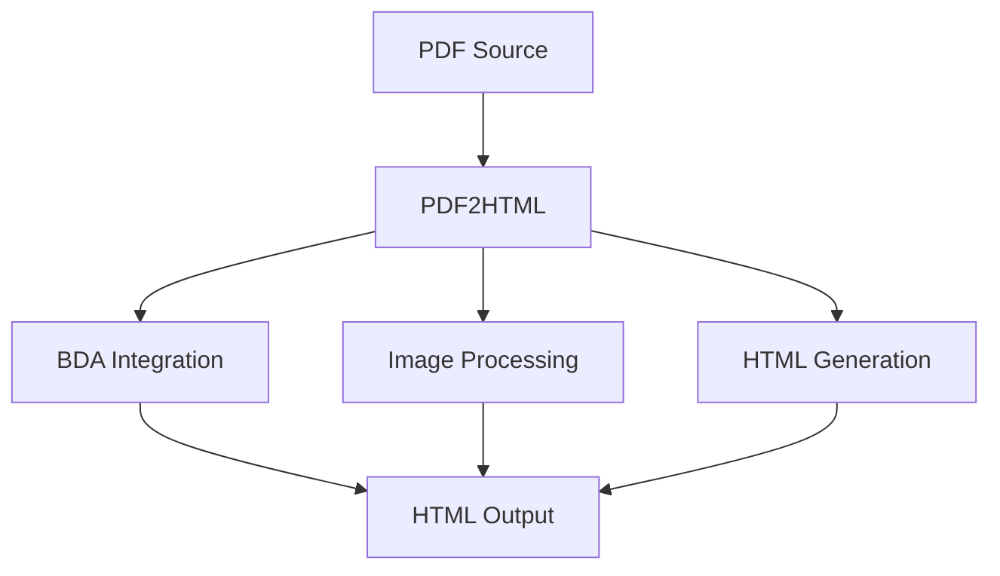
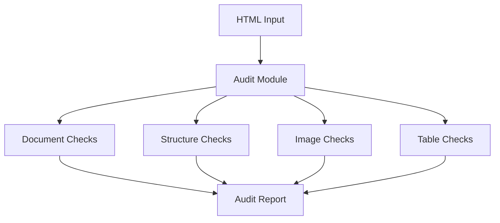
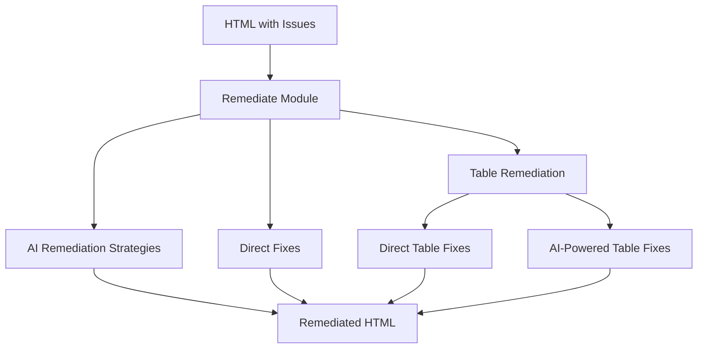
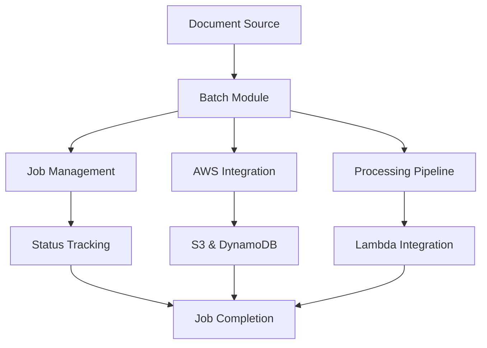

<!--
 Copyright 2025 Amazon.com, Inc. or its affiliates.
 SPDX-License-Identifier: Apache-2.0
-->

# Content Accessibility Utility on AWS

Digital content stakeholders across industries aim to streamline how they meet accessibility compliance standards efficiently. The “Content Accessibility Utility on AWS” offers a comprehensive solution for modernizing web content accessibility with state-of-the-art Generative AI models, powered by Amazon Bedrock. “Content Accessibility Utility on AWS” allows users to automatically audit and remediate WCAG 2.1 accessibility compliance issues. To get started, the solution offers a Python CLI and API. Capabilities currently include batch processing capabilities for handling large volumes of content efficiently, usage tracking to enable detailed cost management, and will continue to expand capabilities to support other content type and modals.

## Table of Contents
- [Features](#features)
- [Prerequisites](#prerequisites)
- [Installation](#installation)
- [Configuration](#configuration)
- [Architecture](#architecture)
- [Core Packages](#core-packages)
  - [PDF2HTML](#pdf2html)
  - [Audit](#audit)
  - [Remediate](#remediate)
  - [Batch](#batch)
- [Command Line Interface](#command-line-interface)
- [Python API](#python-api)
- [Requirements](#requirements)
- [License](#license)

## Features

- Convert PDF documents to accessible HTML
- Preserve layout and visual appearance
- Extract and embed images
- Audit HTML for WCAG 2.1 accessibility compliance
- Remediate common accessibility issues using Bedrock models
- Advanced table remediation strategies
- Support for single-page and multi-page output formats
- Batch processing capabilities for large-scale document processing
- Detailed usage tracking for BDA pages and Bedrock tokens
- Cost analysis tools for resource usage monitoring
- Streamlit sample web interface with usage visualization

## Prerequisites

Before using the Content Accessibility with AWS tool, ensure the following prerequisites are met:

1. **AWS Account**: You need an AWS account with appropriate permissions.
2. **S3 Bucket**: Create an S3 bucket for storing input files, intermediate results, and outputs.
   ```bash
   aws s3 mb s3://my-accessibility-bucket
   ```
3. **BDA Project**: Set up an AWS Bedrock Data Automation (BDA) project.
   ```bash
   aws bedrock-data-automation create-data-automation-project \
       --project-name my-accessibility-project \
       --standard-output-configuration '{"document": {"extraction": {"granularity": {"types": ["DOCUMENT", "PAGE", "ELEMENT"]},"boundingBox": {"state": "ENABLED"}},"generativeField": {"state": "DISABLED"},"outputFormat": {"textFormat": {"types": ["HTML"]},"additionalFileFormat": {"state": "ENABLED"}}}}'
   ```

   Note the `projectArn` from the output, as it will be required for processing.

4. **AWS CLI Configuration**: Configure AWS credentials and default region.
   ```bash
   aws configure
   ```

## Installation

```bash
# From PyPI
pip install content-accessibilty-utility-on-aws

# From source
pip install .

```

## Configuration

### Environment Variables

Set the following environment variables to configure the tool:

```bash
export BDA_S3_BUCKET=my-accessibility-bucket
export BDA_PROJECT_ARN=arn:aws:bedrock:us-west-2:123456789012:project/my-accessibility-project
```

Optional environment variables:
- `AWS_PROFILE`: Specify an AWS CLI profile to use.
- `CONTENT_ACCESSIBILITY_WORK_DIR`: Directory for temporary files (default: system temp).

### Example Configuration File

The tool supports configuration files for easier setup. Below is an example configuration file (`my-config.yaml`):

```yaml
# PDF conversion settings
pdf:
  extract_images: true
  image_format: png
  embed_images: false
  single_file: true
  continuous: true
  embed_fonts: false
  exclude_images: false
  cleanup_bda_output: false

# Accessibility audit settings
audit:
  audit_accessibility: true
  min_severity: minor
  detailed_context: true
  skip_automated_checks: false
  issue_types: null  # Set to a list of specific issue types or null for all

# Remediation settings
remediate:
  max_issues: 100
  model_id: amazon.nova-lite-v1:0
  issue_types: null
  severity_threshold: minor
  report_format: json

# AWS settings
aws:
  # To use an existing BDA project:
  create_bda_project: false
  bda_project_arn: "arn:aws:bedrock:us-west-2:123456789012:project/my-accessibility-project"
  
  # OR to create a new BDA project:
  # create_bda_project: true
  # bda_project_name: "my-new-accessibility-project"
  
  s3_bucket: my-accessibility-bucket
```

## Architecture

The package consists of four main modules working together to convert, audit, remediate, and batch process documents:



## Core Packages

### PDF2HTML

The PDF2HTML module handles conversion of PDF documents to HTML, including image extraction and processing.



Key components:
- Bedrock Data Automation (BDA) integration for PDF parsing
- Image extraction and processing
- HTML structure generation with preserved layout
- Support for both single-page and multi-page output

### Audit

The Audit module analyzes HTML for accessibility issues according to WCAG 2.1 guidelines.



Key components:
- Comprehensive accessibility checks
- Issue severity classification
- Detailed context information
- Multiple report formats (HTML, JSON, text)

### Remediate

The Remediate module fixes accessibility issues identified during audit.



Key components:
- AI-powered remediation using Bedrock models
- Direct fixes for common issues
- Advanced table structure remediation
- Image accessibility enhancements
- Remediation reporting

### Batch

The Batch module provides orchestration for processing documents at scale.



Key components:
- AWS service integrations
- Job tracking and status management
- Asynchronous processing
- Lambda function support

## Command Line Interface

The package provides a command-line interface with several subcommands:

### PDF to HTML Conversion

```bash
content-accessibilty-utility-on-aws convert --input path/to/document.pdf --output output/directory
```

Options:
- `--single-file`: Generate a single output file
- `--single-page`: Combine all pages into a single HTML document
- `--multi-page`: Keep pages as separate HTML files
- `--extract-images`: Extract and include images from the PDF (default: True)
- `--image-format [png|jpg|webp]`: Format for extracted images
- `--embed-images`: Embed images as data URIs in HTML
- `--s3-bucket`: Name of an existing S3 bucket to use
- `--bda-project-arn`: ARN of an existing BDA project to use
- `--create-bda-project`: Create a new BDA project if needed
- `--config`: Path to configuration file

### Accessibility Audit

```bash
content-accessibilty-utility-on-aws audit --input path/to/document.html --output accessibility-report.json --format json
```

For HTML report:

```bash
content-accessibilty-utility-on-aws audit --input path/to/document.html --output accessibility-report.html --format html
```

Options:
- `--format`, `-f [json|html|text]`: Output format for audit report
- `--checks`: Comma-separated list of checks to run
- `--severity [minor|major|critical]`: Minimum severity level to include in report
- `--detailed`: Include detailed context information in report (default: True)
- `--summary-only`: Only include summary information in report
- `--config`: Path to configuration file

### Remediation

```bash
content-accessibilty-utility-on-aws remediate --input path/to/document.html --output remediated.html
```

Options:
- `--auto-fix`: Automatically fix issues where possible
- `--max-issues`: Maximum number of issues to remediate
- `--model-id`: Bedrock model ID to use for remediation
- `--severity-threshold [minor|major|critical]`: Minimum severity level to remediate
- `--audit-report`: Path to audit report JSON file to use for remediation
- `--single-page`: Combine all pages into a single HTML document
- `--multi-page`: Keep pages as separate HTML files 
- `--generate-report`: Generate a remediation report after remediation (default: True)
- `--report-format [html|json|text]`: Format for the remediation report
- `--config`: Path to configuration file

### Complete Processing

```bash
content-accessibilty-utility-on-aws process --input path/to/document.pdf --output output/directory
```

This command runs the full workflow:
1. Converts PDF to HTML
2. Audits the HTML for accessibility issues
3. Remediates the issues found

Options:
- `--skip-audit`: Skip the audit step
- `--skip-remediation`: Skip the remediation step
- `--audit-format [json|html|text]`: Format for the audit report
- `--severity [minor|major|critical]`: Minimum severity level for audit and remediation
- `--auto-fix`: Automatically fix issues where possible
- Plus all options available in the individual commands
- `--config`: Path to configuration file

### Use a configuration file

```bash
content-accessibilty-utility-on-aws convert --config my-config.yaml --input document.pdf
```

### Override config file settings with command-line arguments

```bash
content-accessibilty-utility-on-aws audit --config my-config.yaml --severity major --input document.html
```

## Common Options

These options are available for all commands:

- `--input`, `-i`: Input file or directory path (required)
- `--output`, `-o`: Output file or directory path (defaults to a path based on input name)
- `--debug`: Enable debug logging
- `--quiet`, `-q`: Only output reports, suppress other output
- `--config`, `-c`: Path to configuration file
- `--profile`: AWS profile name to use for credentials

## Output Structure

### Convert Command Output

```
output-directory/
├── extracted_html/              # Directory with HTML files
│   ├── document.html            # Combined HTML file (if --single-file)
│   ├── page-0.html              # Individual page files (if not --single-file)
│   ├── page-1.html
│   └── ...
└── images/                      # Directory with extracted images
    ├── image-0.png
    ├── image-1.png
    └── ...
```

### Process Command Output

```
output-directory/
├── html/                        # Directory with HTML files
├── images/                      # Directory with extracted images
├── audit_report.[json|html|txt] # Audit report
└── remediated_document.html     # Final remediated HTML file
```

## Streamlit Sample Web Interface
A sample Streamlit web interface has been developed to demonstrate the functionality of the Document Accessibility tool. This interface allows users to upload documents, configure processing options, and view results interactively.
To learn more about the Streamlit interface, refer to the [Streamlit Guide](docs/streamlit_guide.md).

## Python API

The package provides a Python API for programmatic use:

### Complete Processing Pipeline

```python
from content_accessibility_with_aws.api import process_pdf_accessibility

# Process a PDF through the full pipeline
result = process_pdf_accessibility(
    pdf_path="document.pdf",
    output_dir="output/",
    conversion_options={
        "single_file": True,
        "image_format": "png"
    },
    audit_options={
        "severity_threshold": "minor",
        "detailed": True
    },
    remediation_options={
        "model_id": "amazon.nova-lite-v1:0",
        "auto_fix": True
    },
    perform_audit=True,
    perform_remediation=True
)
```

### Individual Components

```python
from content_accessibility_with_aws.api import (
    convert_pdf_to_html,
    audit_html_accessibility,
    remediate_html_accessibility
)

# Convert PDF to HTML
conversion_result = convert_pdf_to_html(
    pdf_path="document.pdf",
    output_dir="output/",
    options={
        "single_file": True,
        "image_format": "png"
    }
)

# Audit HTML for accessibility issues
audit_result = audit_html_accessibility(
    html_path="output/document.html",
    options={
        "severity_threshold": "minor",
        "detailed_context": True
    }
)

# Remediate accessibility issues
remediation_result = remediate_html_accessibility(
    html_path="output/document.html",
    audit_report=audit_result,
    options={
        "model_id": "amazon.nova-lite-v1:0",
        "auto_fix": True
    }
)
```

### Batch Processing

```python
from content_accessibility_with_aws.batch import (
    submit_batch_job,
    check_job_status,
    get_job_results
)

# Submit a batch job
job_id = submit_batch_job(
    input_bucket="my-bucket",
    input_key="documents/file.pdf",
    output_bucket="my-bucket",
    output_prefix="results/",
    process_options={
        "perform_audit": True,
        "perform_remediation": True
    }
)

# Check job status
status = check_job_status(job_id)

# Get job results when complete
if status["status"] == "COMPLETED":
    results = get_job_results(job_id)
```

## Requirements

- Python 3.11+
- AWS credentials for Bedrock Data Automation and Bedrock models
- Appropriate IAM permissions for S3 and BDA services

For AWS credentials configuration:
1. Set up AWS CLI with `aws configure`
2. Use environment variables (AWS_ACCESS_KEY_ID, AWS_SECRET_ACCESS_KEY)
3. Or specify a profile with the `--profile` option

## License

Apache-2.0 License. See [LICENSE](LICENSE) for details.

## Contributing
Contributions are welcome! Please see [CONTRIBUTING.md](CONTRIBUTING.md) for details on how to contribute to this project.

